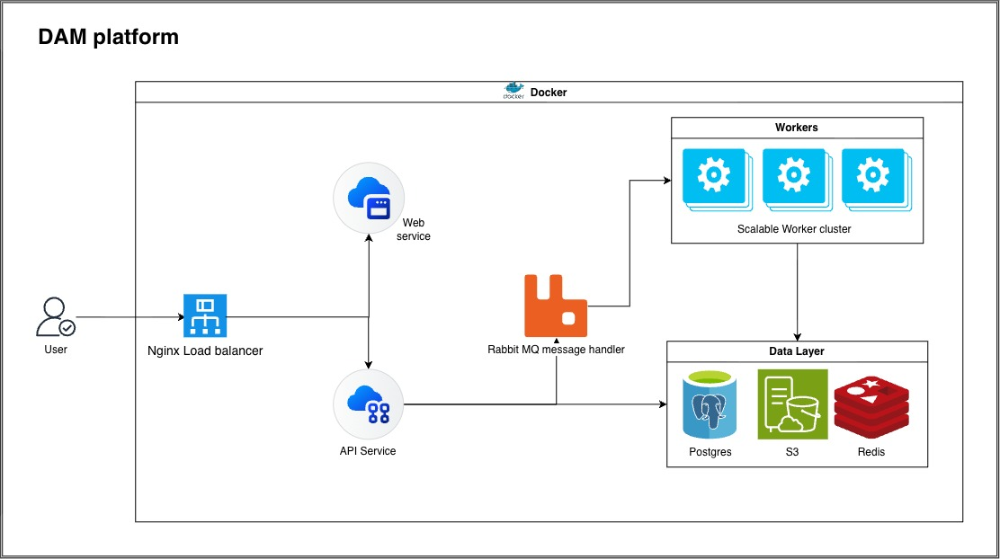

# DAM Platform

A Digital Asset Management (DAM) platform for uploading, storing, processing, and retrieving images and videos at scale.

## Features

- **Asset upload & storage**: upload images and videos to S3-compatible object storage
- **Background processing**: queue-based jobs for thumbnails, previews, video transcoding, and metadata extraction
- **Tagging, search & filtering**: organize assets and find them quickly
- **Previews & downloads**: view generated renditions and download originals
- **Analytics**: track asset usage
- **Horizontal scaling**: scale API and worker instances independently

## Tech Stack

| Layer | Technology |
| --- | --- |
| Frontend | React, Tailwind CSS, TypeScript, Vite |
| Backend | Node.js, Express, TypeScript |
| Load Balancer | Nginx |
| Queue | RabbitMQ |
| Database | PostgreSQL |
| Cache | Redis |
| Object Storage | MinIO (S3-compatible) |
| Media Processing | FFmpeg, Sharp |
| Deployment | Docker Compose (with scale configs) |
| Package Manager | pnpm (workspaces) |

## Architecture



1. User traffic enters through the **Nginx load balancer**, which routes requests to the **web service** and the **API service**.
2. The **API service** stores uploaded files in **S3-compatible object storage (MinIO)**, keeps asset metadata in **PostgreSQL**, and uses **Redis** for caching.
3. For processing, the API publishes jobs to **RabbitMQ**.
4. A **scalable worker cluster** consumes those jobs, generates renditions with **FFmpeg** (video) and **Sharp** (images), and writes the results back to the data layer.
5. All services run in **Docker**, and the API and workers scale horizontally.

## Project Structure

```
.
├── docs/
│   └── architecture.jpg
├── services/
│   ├── web/        React + Tailwind + TypeScript frontend
│   └── api/        Express + TypeScript API service
├── package.json
└── pnpm-workspace.yaml
```

## Prerequisites

- Node.js 22+
- pnpm 10+
- Docker with Docker Compose (Docker Desktop or Colima)
- FFmpeg

## Getting Started

```bash
git clone git@github.com:sambit-srcm/dam-platform.git
cd dam-platform
pnpm install
```

## Status

Early setup. The monorepo and service dependencies are in place; application code, the worker service, and the Docker Compose setup are in progress.
