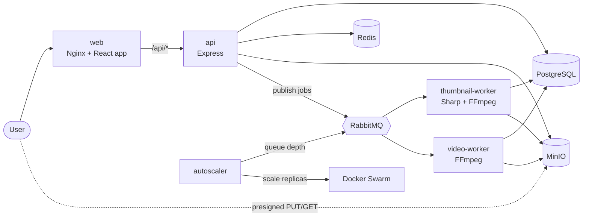

# DAM Platform

A Digital Asset Management (DAM) platform for uploading, storing, processing, and retrieving images, videos and PDFs at scale.

## Features

- **Accounts & access control**: register and sign in with JWT tokens; users see their own assets, admins see everything
- **Resumable uploads**: files go straight from the browser to S3-compatible storage in parts, and a failed upload can be retried by sending only the missing parts
- **Background processing**: queue-based jobs generate image and video thumbnails and transcode videos into 1080p and 720p renditions
- **Tagging, search & filtering**: tags are made from the file name and details; filter by name, type, tag, status and date
- **Previews & downloads**: view renditions in the browser, download originals through short-lived links
- **Analytics**: per-asset and daily download counts, plus an admin dashboard
- **Horizontal scaling**: API replicas and workers scale independently, and an autoscaler adds and removes workers based on queue depth

## Tech Stack

| Layer            | Technology                                            |
| ---------------- | ----------------------------------------------------- |
| Frontend         | React, Tailwind CSS, TypeScript, Vite                 |
| Backend          | Node.js, Express 5, TypeScript, Zod                   |
| Edge / proxy     | Nginx (serves the web app, proxies `/api` to the API) |
| Queue            | RabbitMQ (quorum queues with dead letter queues)      |
| Database         | PostgreSQL with Drizzle ORM                           |
| Cache            | Redis                                                 |
| Object Storage   | MinIO (S3-compatible)                                 |
| Media Processing | FFmpeg, Sharp                                         |
| Deployment       | Docker Swarm stack (Docker Compose for local infra)   |
| Package Manager  | pnpm (workspaces)                                     |
| Testing          | Vitest                                                |

## Architecture


The image above shows the core flow. The diagram below adds the autoscaler and the direct-to-storage upload path.



### Request flow

1. The browser talks to the **web** container. Nginx serves the React app and forwards `/api/*` to the **API**, stripping the prefix.
2. The **API** authenticates every request except `/health/*`, `/auth/register` and `/auth/login`, stores metadata in **PostgreSQL**, and uses **Redis** for download statistics, upload progress and a lock for the cleanup sweeper.
3. On startup the API applies pending database migrations under a Postgres advisory lock, so several replicas can start together safely.

### Uploads

Files never pass through the API.

1. `POST /assets/uploads` declares the file. The API opens a multipart upload in MinIO, creates the asset with status `uploading`, and returns the part plan (5 MiB or larger parts, at most 10,000 of them).
2. The browser asks for presigned URLs (`POST …/parts`, up to 10 at a time) and `PUT`s each part directly to MinIO.
3. `POST …/complete` makes the API check storage for the right parts and total size, finish the multipart upload, and publish the processing jobs. A size mismatch aborts the upload and marks the asset `failed`.
4. If a part fails, the upload stays open. The web app shows a **Retry** button that asks `GET /assets/uploads/:id` which parts arrived and sends only the missing ones.
5. Uploads are limited to `MAX_UPLOAD_MB` (300 by default) and stay open for one hour. A sweeper running every ten minutes aborts expired uploads and marks them `failed` (`upload_expired`).
6. While the queue is down, uploads of types that need processing are refused with `503`, so a file is never accepted that cannot be processed.

### Processing

- Jobs are published to RabbitMQ with publisher confirms, and with `mandatory` so a job with no queue bound is reported instead of silently dropped.
- Queues are quorum queues. A failed job is redelivered up to 5 times and then dead-lettered to a `.dlq` queue (`dam.thumbnail-generation.dlq`, `dam.video-processing.dlq`). Unparseable or permanently failing jobs go to the dead letter queue straight away.
- **thumbnail-worker** makes a 400 px WebP thumbnail from an image, or from a frame near the start of a video, and records image metadata.
- **video-worker** probes the video, then transcodes 1080p and 720p renditions (never upscaling, always at least one), uploading each before starting the next. The asset becomes `ready` when done.
- Asset status moves through `uploading` → `uploaded` → `processing` → `ready`, or ends as `failed` with a `failureReason`. PDFs skip processing and go straight to `ready`.
- Workers write a heartbeat file that the container health check reads, and stop cleanly on `SIGTERM`.

### Scaling

- The **autoscaler** polls the RabbitMQ management API and scales the `thumbnail-worker` and `video-worker` Swarm services through the Docker socket, between configured minimum and maximum replicas, with a cooldown before scaling down.
- Worker containers have CPU and memory limits, so a transcode cannot starve PostgreSQL or the API on the same host.
- The deployment defaults cap each worker at 2 replicas. Raise `IMAGE_MAX_REPLICAS` and `VIDEO_MAX_REPLICAS` on the autoscaler together with the host size.

## API

The full REST API is described in [`docs/openapi.yaml`](docs/openapi.yaml) (OpenAPI 3.1).

| Area    | Endpoints                                                                                                                |
| ------- | ------------------------------------------------------------------------------------------------------------------------ |
| Health  | `GET /health`, `/health/live`, `/health/ready`                                                                           |
| Auth    | `POST /auth/register`, `POST /auth/login`, `GET /auth/me`                                                                |
| Assets  | `GET /assets`, `GET /assets/tags`, `GET /assets/:id`, `GET /assets/:id/view`, `POST /assets/:id/download`                |
| Uploads | `POST /assets/uploads`, `GET` / `DELETE /assets/uploads/:id`, `POST …/parts`, `POST …/parts/recorded`, `POST …/complete` |
| Admin   | `GET /admin/dashboard`, `GET /admin/assets`, `GET /admin/assets/:id`, `GET /admin/tags` (admin role only)                |

Errors always look like `{ "error": { "code", "message", "requestId" } }`.

The API serves its own docs, no login needed: `http://localhost:8080/api/docs/` through the web container, or `http://localhost:3000/docs/` directly. The raw spec is at `/docs/openapi.yaml`.

## Project Structure

```
.
├── docs/
│   ├── architecture.jpg
│   └── openapi.yaml       OpenAPI 3.1 description of the API
├── packages/
│   ├── db/                Drizzle schema, migrations and the migration runner
│   └── queue/             RabbitMQ topology, publishing and consuming, dead letter handling
├── services/
│   ├── web/               React + Tailwind + TypeScript frontend, served by Nginx
│   ├── api/               Express API (auth, assets, uploads, admin)
│   ├── thumbnail-worker/  Image and video thumbnails
│   ├── video-worker/      Video probing and transcoding
│   └── autoscaler/        Scales the workers from queue depth
├── docker-compose.yml     Local infrastructure (Postgres, Redis, MinIO, RabbitMQ)
├── docker-stack.yml       Full stack for Docker Swarm
├── package.json
└── pnpm-workspace.yaml
```

## Prerequisites

- Node.js 22+
- pnpm 10+
- Docker (Docker Desktop or Colima)
- FFmpeg (only to run the workers outside Docker)

## Getting Started

```bash
git clone git@github.com:sambit-srcm/dam-platform.git
cd dam-platform
pnpm install
cp .env.example .env   # then set JWT_SECRET: openssl rand -hex 32
```

### Local development

Start the infrastructure, then the services you are working on:

```bash
docker compose up -d                     # Postgres, Redis, MinIO, RabbitMQ
pnpm --filter @dam/api dev               # runs migrations, then serves on :3000
pnpm --filter @dam/web dev               # Vite dev server on :5173
pnpm --filter @dam/thumbnail-worker dev
pnpm --filter @dam/video-worker dev
```

The API reads the `.env` file in the repository root. Keep `CORS_ORIGIN` in step with the address the web app is served from.

### Running the whole stack on Docker Swarm

```bash
docker swarm init                        # once
docker build -t dam-api:local              -f services/api/Dockerfile .
docker build -t dam-web:local              -f services/web/Dockerfile .
docker build -t dam-thumbnail-worker:local -f services/thumbnail-worker/Dockerfile .
docker build -t dam-video-worker:local     -f services/video-worker/Dockerfile .
docker build -t dam-autoscaler:local       -f services/autoscaler/Dockerfile .

set -a; source .env; set +a              # the stack file reads its values from the environment
docker stack deploy --resolve-image never -c docker-stack.yml dam-platform
```

The web app is then at <http://localhost:8080> and the API at <http://localhost:3000>. Watch the services with `docker stack services dam-platform`.

## Configuration

Every service validates its environment at startup and exits with a list of the problems. The variables you will most often change:

| Variable                                   | Service    | Purpose                                             | Default                    |
| ------------------------------------------ | ---------- | --------------------------------------------------- | -------------------------- |
| `JWT_SECRET`                               | api        | Signs login tokens, required                        | none                       |
| `JWT_EXPIRES_IN_SECONDS`                   | api        | Token lifetime                                      | 3600                       |
| `MAX_UPLOAD_MB`                            | api        | Largest accepted upload (keep equal in the web app) | 300                        |
| `CORS_ORIGIN`                              | api        | Browser origins allowed to call the API             | local                      |
| `RATE_LIMIT_ENABLED`                       | api        | Request limits per address and per user             | true                       |
| `UPLOAD_SESSION_TTL_SECONDS`               | api        | How long an unfinished upload stays open            | 3600                       |
| `SHUTDOWN_TIMEOUT_MS`                      | api        | Time allowed to drain on shutdown                   | 10000                      |
| `VIDEO_PREFETCH`, `FFMPEG_THREADS`         | video      | Jobs at once and threads per encode                 | 1, 2                       |
| `IMAGE_MAX_REPLICAS`, `VIDEO_MAX_REPLICAS` | autoscaler | Upper bound on worker replicas                      | 6, 4                       |
| `POLL_INTERVAL_MS`                         | autoscaler | How often queue depth is checked                    | 30000 (15000 in the stack) |

`.env.example` lists the rest.

## Security notes

- **Rate limiting.** The API counts requests in Redis, so every replica shares one count. Failed sign-ins are limited per account and per address, sign-ups per address, upload starts per user, and everything else per address and per user. Going over answers `429` with `Retry-After`. Limits live in `services/api/src/shared/middlewares/rateLimit.ts`.
- **Security headers.** The API sets them with helmet, and nginx sets them on the web app, including a Content Security Policy that restricts scripts to the app's own origin. The `/docs` page relaxes its policy only enough to load Redoc from jsdelivr.

## Testing and quality

```bash
pnpm test             # Vitest across every workspace
pnpm test:coverage    # with coverage reports
pnpm lint             # ESLint
pnpm format:check     # Prettier
```

Tests cover the essentials: access control and route protection, upload planning and validation, queue publishing and retry behaviour, autoscaling decisions, and the main web flows. Git hooks run the linters, a secret scan and commit message checks, and CI runs the same checks on pull requests.

## Status

The platform runs end to end: accounts, resumable uploads, image and video processing, admin reporting, and autoscaled workers on Docker Swarm. Known gaps before a production deployment: services use the MinIO root credentials, and images are built locally rather than pulled from a registry.
